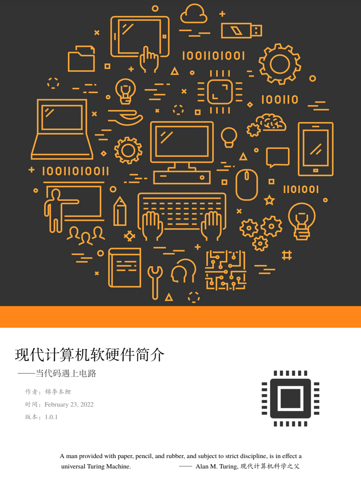

# 现代计算机软硬件简介

## 目录

1. 计算机简介
    1. 计算机发展简史
        - 手动式计算机
        - 机械式计算机
        - 机电式计算机
        - 电子计算机
        - 现代电子计算机
    1. 计算机的分类
        - 按运行原理分
        - 按通用性分
        - 按适用范围分
    1. 第1章习题

1. 现代数字计算机基础数学物理知识
    1. 二进制
        - 数的进制
        - 进制转换
        - 编码——万物皆数
    1. 逻辑代数
        - 简单逻辑运算
        - 运算律
        - 逻辑函数与化简
    1. 逻辑电路
        - 逻辑门
        - 组合逻辑
        - 可编程逻辑
    1. 第2章习题

1. 现代计算机基本原理简介
    1. 图灵机模型
        - 图灵机
        - 可计算性
        - 图灵完备
    1. 计算机体系结构简介
        - 计算机体系结构
        - 冯·诺伊曼结构
        - 哈佛结构
        - 改进型哈佛结构
    1. 第3章习题

1. 计算机基本硬件简介
    1. 处理器
        - CPU发展简史
        - CPU的分类
        - CPU的结构
        - CPU制造工艺简介
        - 显卡简介
    1. 存储设备
        - 寄存器
        - 缓存
        - 主存
        - 硬盘
    1. 输入输出
        - 输入设备
        - 输出设备
    1. 主板和外设
        - 主板
        - 外设
    1. 第4章习题

1. 操作系统简介
    1. 操作系统基本结构
        - 驱动
        - 内核
        - 接口库
        - 壳
    1. 操作系统分类
        - 按内核结构分
        - 按应用平台分
    1. 第5章习题

1. 计算机软件简介
    1. 计算机的启动过程简介
        - 上电
        - BIOS
        - 加载启动项
        - 启动操作系统
    1. 编程语言简介
        - 按照等级分
        - 按照运行方式分
    1. 算法
        - 算法基本概念和表示方法
        - 算法复杂度简介
        - 数据结构简介
    1. 软件工程简介
        - 编译过程简介
        - 软件开发流程
    1. 第6章习题

1. 附录
    1. 国际单位制词头
    1. 摩尔定律发展图
    1. ASCII编码表
    1. 英特尔和AMD桌面级CPU世代表

1. 索引
    1. 名词索引
    2. 人名索引

## 版权

本书使用[CC-BY-NC-ND 4.0协议](LICENSE.md)。

- 作者保留本书一切权利
- 允许在各个互联网平台上复制、下载、分享、传播本书
- BY：必须按照作者或者许可人指定的方式对作品进行署名
- NC：不得为商业目的而使用本书
- ND：不得改变、转变或更改本书